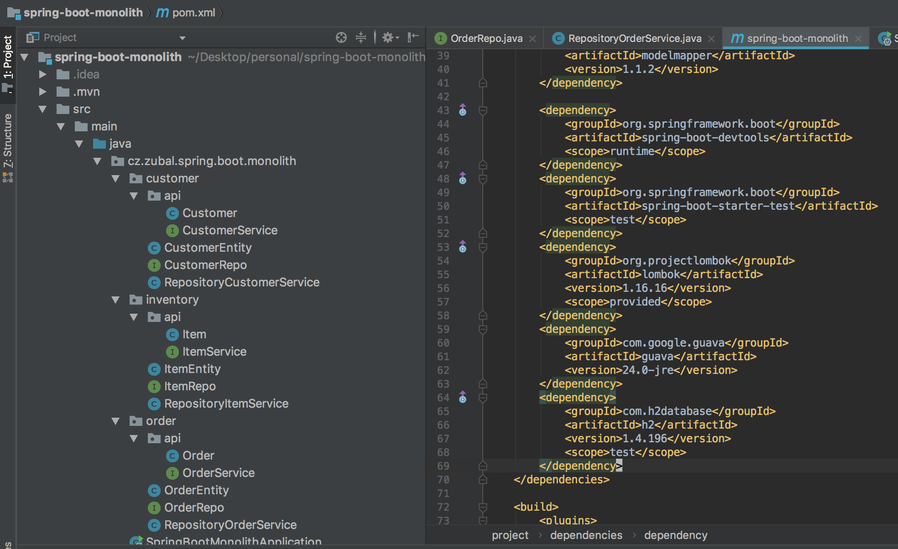

# Simple Spring-boot Monolith
This repository represents a very simple proof of concept of creating a *monolithic* *spring-boot* project with *separation* of internal components via Java APIs (hiding their internals from others). This is intentionally the most simple way of doing this using Java visibility modifiers (and verifying this works well with Spring and other libraries), but there might be better choices for bigger projects (like maven/gradle modules or microservices).

The APIs are very loosely coupled and it would be quite easy to change e.g. the persistence for each "service" or transform this to use modules (you can check how that looks e.g. in [spring-gradle-kotlin-multimodule](https://github.com/mzubal/spring-gradle-kotlin-multimodule)) or microservice.

The project uses *spring-data* as a persistence layer for all the "services". It also takes advantage of *ObjectMapper* and *Lombok* to reduce the boilerplate needed.

The package structure of the project is following, with each "service" residing in it's package:

